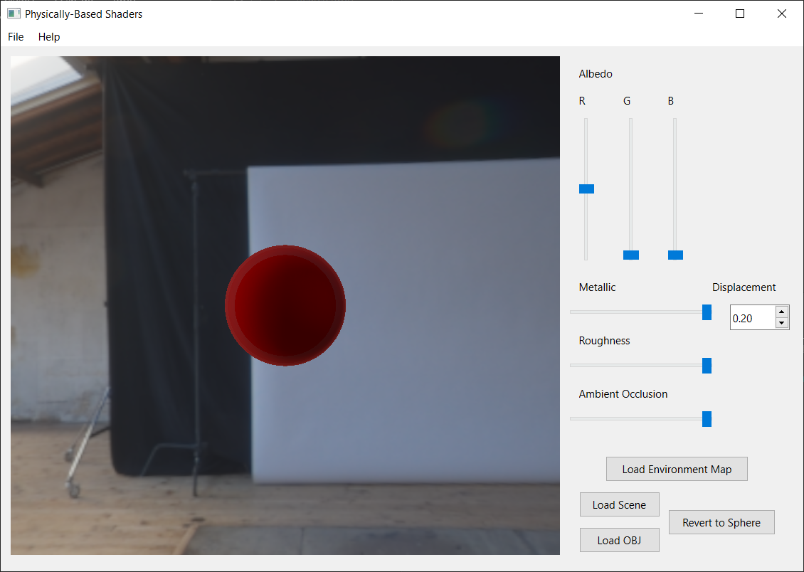

# Physically-based-Shader
 The PBR implementation uses the Cook-Torrance model in a physically based rendering pipeline, along with image-based lighting, as well as custom scenes and environment maps. This implementation is based on paper [Real Shading in Unreal Engine 4](https://blog.selfshadow.com/publications/s2013-shading-course/karis/s2013_pbs_epic_notes_v2.pdf)

 For more renders and detailed explanation, please visit my personal page [Physically-Based Shaders](https://jichu.art/index.php/physically-based-shaders/)
 

# Showcases(Custom External Model)

 
 
 

#  Renders with Diff Metallic & Roughness Value

| 1 Metallic 0 Roughness|
| ------------------------------------ |
|          |

| 1 Metallic 0.25 Roughness|
| ------------------------------------ |
|          |

| 1 Metallic 0.5 Roughness|
| ------------------------------------ |
|          |

| 1 Metallic 0.75 Roughness|
| ------------------------------------ |
|          |

| 1 Metallic 1 Roughness|
| ------------------------------------ |
|          |

| 1 Metallic 1 Roughness|
| ------------------------------------ |
|          |
